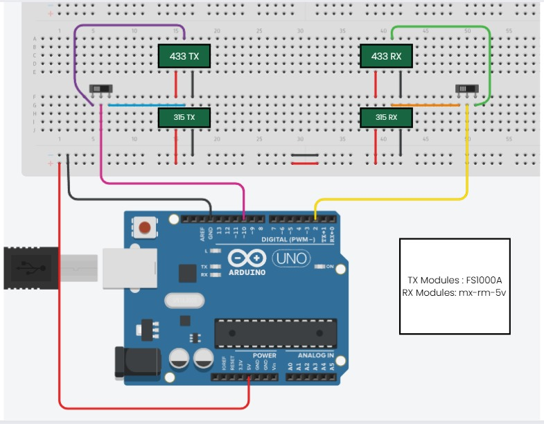

# SignalHUB

**Disclaimer**: This project is intended for educational purposes and authorized access only. The creator is not responsible for any unauthorized or illegal use of this project. Use it responsibly and only on devices you own or have permission to test.

---

This project demonstrates how to perform a signal replay attack using an Arduino. It is designed to work with **315MHz and 433MHz frequencies**.
The project captures and replays signals from devices operating at these frequencies, but it **only works if there is no security system like rolling codes** in place.

---

## Contents
- **Schematic**: Circuit diagram for the replay attack setup.
- **Code**: Arduino code to capture and replay signals.

---

## How It Works
This project allows you to capture, save, and replay RF signals using an Arduino. It supports the following commands via the Serial Monitor:

### Commands:
1. **SAVE `<name>`**  
   - Saves the most recently received signal with a name (max 10 characters).  
   - Example: `SAVE GarageDoor`  
   - **Note**: You can store up to 12 signals.

2. **SEND `<name>`**  
   - Transmits a saved signal by its name.  
   - Example: `SEND GarageDoor`  
   - **Note**: The signal must be saved first using the `SAVE` command.

3. **DELETE `<name>`**  
   - Deletes a saved signal by its name.  
   - Example: `DELETE GarageDoor`  

4. **LIST**  
   - Lists all saved signals.  
   - Example: `LIST`  

5. **RESET**  
   - Clears all saved signals and resets the EEPROM.  
   - Example: `RESET`  

### Workflow:
1. **Capture a Signal**:  
   - When a signal is received, the Arduino will notify you via the Serial Monitor.  
   - Use the `SAVE <name>` command to store the signal with a unique name.

2. **Replay a Signal**:  
   - Use the `SEND <name>` command to transmit a saved signal.  
   - The Arduino will replay the signal using the transmitter module.

3. **Manage Signals**:  
   - Use `LIST` to view all saved signals.  
   - Use `DELETE <name>` to remove a signal.  
   - Use `RESET` to clear all saved signals and start fresh.

---

## Requirements
- Arduino Uno
- 1x FS1000A (315MHz transmitter)
- 1x FS1000A (433MHz transmitter)
- 1x MX-RM-5V (315MHz receiver)
- 1x MX-RM-5V (433MHz receiver)
- Jumper wires
- 2x Slide Switch
- Breadboard

---

## Schematic

---

## Code
Upload `signalhub_code.ino` to your Arduino.

---

## Limitations
- This project **only works on devices without security mechanisms** like rolling codes or encryption.
- It is designed for **315MHz and 433MHz frequencies** and may not work with other frequencies.
- The number of characters allowed for naming a signal and the total number of saved signals are limited. However, you can modify these limits by updating the code to suit your needs.

---
## Credits
This project uses the **RCSwitch** library for sending and receiving RF signals. Special thanks to the creators and contributors of the library for making it available to the community.

- **RCSwitch Library**: [GitHub Repository](https://github.com/sui77/rc-switch)
  
---
## License
- This project is open-source. 
---
## Author
KA
